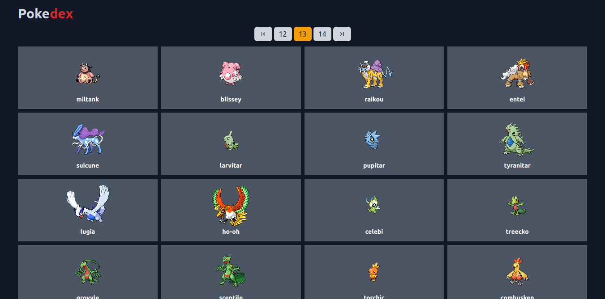
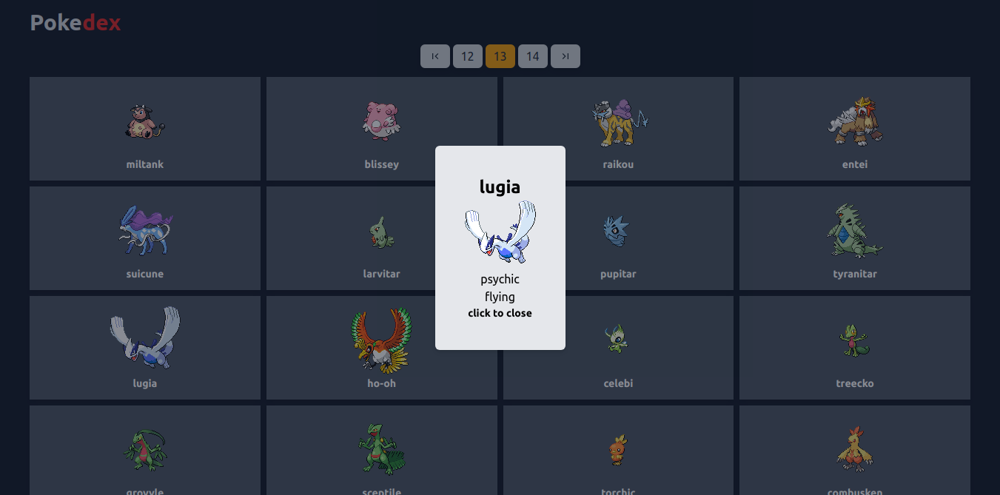
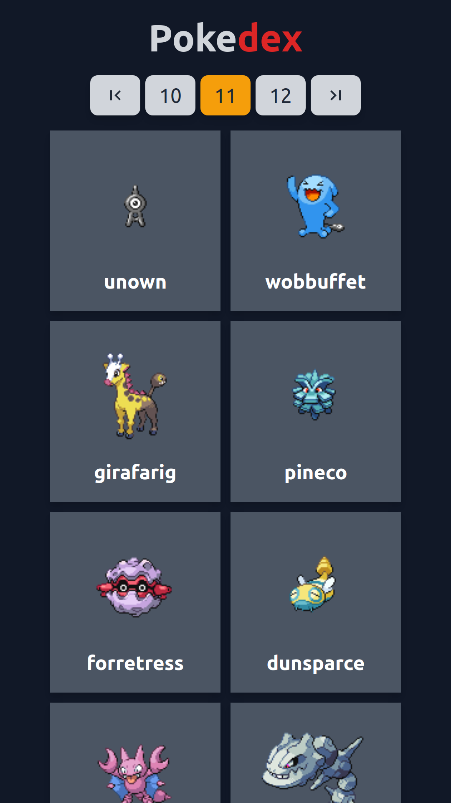
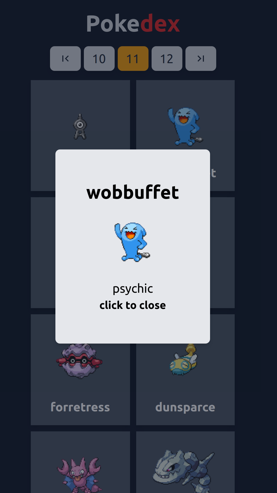

# Simple Pokedex
Uma Pokedex completa criada com fins educativos.
#
## pré requisitos
para o webapp funcionar sem problemas é preciso ter o >= node:10
#
## como usar
``` 
 git clone git@github.com:luizphelipe800/simple-pokedex.git
```
```
cd ./simple-pokedex
```
```
yarn && yarn start
```
#
## demonstração



#



#



#



#

## Técnologias

* [React JS](https://github.com/facebook/react)
* [Tailwind CSS](https://github.com/tailwindlabs/tailwindcss)
* [PokeApi](https://pokeapi.co/)